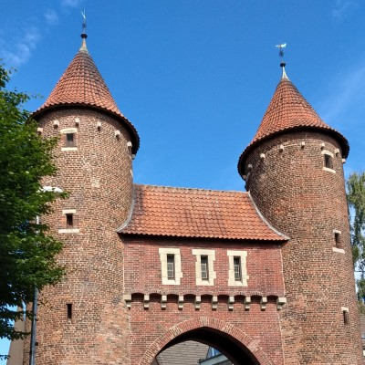

# Bootstrap CSS Tooltips

[](https://www.getbootstrap.com/)
[](https://sass-lang.com/)
[](https://nodejs.org/en/)
[](https://sonarcloud.io/summary/new_code?id=glewe_bootstrap-css-tooltips)

**Bootstrap CSS Tooltips** offers a CSS only tooltip solution supporting Bootstrap colors and HTML content.

Bootstrap itself comes with basic black tooltips that require Javascript (popper.js) and do not support complex HTML content.
I ran into situations where those didn't work, e.g. when the tooltip content is injected via Javascript after the page is loaded.
In such cases, CSS based tooltips still work well.

On my search for a CSS based tooltip library I did not find one that fulfilled all my requirements, thus, I wrote this one here to serve my specific use cases.

# My Requirements

- no Javascript required
- support for HTML content
- support for Bootstrap colors
- support for positioning top, right, bottom and left

The downside of not having Javascript create the tooltips is not having the automatic computation of the tooltip size and position based on canvas and hover object position.

To work around this I chose to position the tooltips relatively to the hover object based on pixel distances. For horizontal sizing, this library offers four different widths. They
can be easily set by a class name:

- small: 160px
- medium: 240px
- large: 320px
- xlarge: 400px

# Demo

[http://demo.lewe-online.de/bootstrap-css-tooltips/](http://demo.lewe-online.de/bootstrap-css-tooltips/)

or

Download the library here and launch `index.html` from the `dist` folder.

# Usage

The library requires that you use Bootstrap 5 on your site. You need to load the BS5 stylesheet first.

After that, load the stylesheet from this library's `dist/css` folder.

For example:

```html
<!--Bootstrap Styles-->
<link href=" https://cdn.jsdelivr.net/npm/bootstrap@5.3.8/dist/css/bootstrap.min.css " rel="stylesheet">
<!--Bootstrap CSS Tooltips-->
<link href="css/bsc-tooltips.min.css" rel="stylesheet">
```
In your HTML code you need a DOM object that holds the hover object and the tooltip content object. The tooltip content object is intially hidden.

For example:

```html
<div class="btn btn-danger bsc-tooltip m-2">
  Top tooltip
  <span class="bsc-tooltip-content danger top">Tooltip Text</span>
</div>
```
In the above example, hovering the Bootstrap button will show a 'danger' colored tooltip at the 'top'.

Here are two more complex examples:

A large dark tooltip showing to the right with a table in it:
```html
<div class="btn btn-dark bsc-tooltip">Right large tooltip
  <div class="bsc-tooltip-content dark right large">
    <div class="row">
      <div class="col-5">Build Job:</div>
      <div class="col-7">my-app (815)</div>
    </div>
    <div class="row">
      <div class="col-5">Build Type:</div>
      <div class="col-7">Production</div>
    </div>
    <div class="row">
      <div class="col-5">Version:</div>
      <div class="col-7">v2.4.3</div>
    </div>
    <div class="row">
      <div class="col-5">Branch:</div>
      <div class="col-7">master</div>
    </div>
    <div class="row">
      <div class="col-5">Build Time:</div>
      <div class="col-7">2023-09-24 15:06</div>
    </div>
    <div class="row">
      <div class="col-5">Duration:</div>
      <div class="col-7">00:12:45</div>
    </div>
  </div>
</div>
```
An xlarge info tooltip popping up at the bottom containing a left floating image with text next to it:
```html
<div class="btn btn-info bsc-tooltip m-2">Bottom xlarge tooltip
  <div class="bsc-tooltip-content info bottom xlarge">
    <p>
      
      Dülmen is a twon in Germany. It is situated in the south part of the Münsterland area,
      between the Lippe river to the south, the Baumberge hills to the north and the Ems
      river to the east. The so-called Ruhrgebiet is located south of Dülmen, once a
      traditional cole mining area.
    </p>
  </div>
</div>

```
# Customization

If you want to make changes to the library, clone the repo like so:

```
git clone https://github.com/glewe/bootstrap-css-tooltips.git
```

Then install the dependencies by running
```
npm install
```

Edit the `src/html/index.html` and `src/scss/bs-tooltips.scss` file to your liking.

Build the result of your changes by running:

```
npm run build
```

The distribution files will be created in the `dist` folder. Launch the `index.html` in there and review your changes.

## Development Watch Mode

You can run a watch mode (using `nodemon --watch` and `browser-sync`) by running:

```
npm run dev
```
Whenever you change files in the `src` folder, the distribution files will be updated and the browser will reload.

# Enjoy

If you have use for this library, feel free to use it anywhere for free.

If you encounter problems or have ideas for improvement, go ahead and open an issue here at GitHub.

Enjoy and best regards,

George
